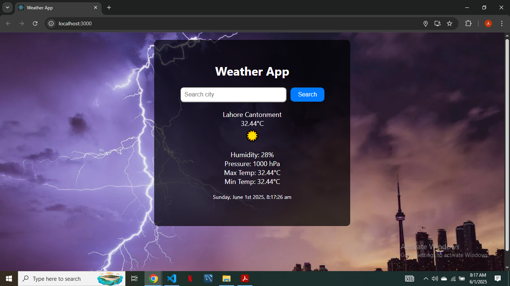

# ☀️ React Weather Application

A modern **Weather Application** built with **ReactJS** that provides live weather updates. It fetches data from a weather API to display current weather conditions based on the user's live location or a city name searched manually.

## 🚀 Features

- Automatically detects user location and shows local weather  
- Search weather by city name  
- Displays temperature, weather condition, humidity, wind speed, and more  
- Clean user interface  

## 🛠️ Tech Stack

- ReactJS  
- CSS3  
- OpenWeatherMap API (or specify your API)  

## 📸 Screenshot

## 🎯 Live Demo

You can check out the live version of this Weather Application here:  
[https://sheikh-abubakr-faisal.github.io/react-weather-app/](https://sheikh-abubakr-faisal.github.io/react-weather-app/)

## 👨‍💻 Author

**Sheikh Abubakr Faisal**  
[abubakrsheikh44@gmail.com](mailto:abubakrsheikh44@gmail.com)

## 📄 License

This project is for learning purposes only.
